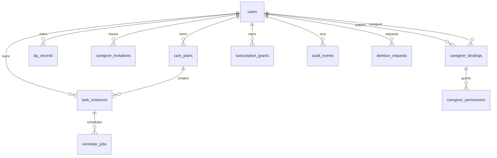

# MVP database ERD and indexes

This is the target MVP model. Through Phase 3, the physical schema includes
`users`, `care_plans`, `task_instances`, and `bp_records`; later tables remain
planned and are introduced by their own numbered, backward-compatible
migrations.

| Table | Key fields and data boundary | Required indexes/constraints |
|---|---|---|
| `users` | internal ID, 32-byte SHA-256 identity reference, IANA timezone, large-text/high-contrast preferences, UTC timestamps | unique `openid_hash`; no plaintext openid |
| `care_plans` | owner, task type, daily local HH:MM schedule, enabled/deleted state | `(owner_id, enabled, deleted_at)` |
| `task_instances` | owner, plan, scheduled local date, UTC schedule, state | unique `(care_plan_id, scheduled_local_date, occurrence_key)`; `(owner_id, scheduled_local_date)`; `(owner_id, state, scheduled_at_utc)` |
| `bp_records` | owner, measured UTC, method, encrypted payload, nonce, key version, request ID | unique `(owner_id, client_request_id)`; `(owner_id, measured_at_utc DESC)` |
| `caregiver_invitations` | patient, hashed code, expiry, single-use state | unique code hash; `(patient_id, expires_at)` |
| `caregiver_bindings` | patient, caregiver, active/revoked state | unique active patient/caregiver semantics; both-user lookup indexes |
| `caregiver_permissions` | binding, permission name | unique `(binding_id, permission_name)` |
| `subscription_grants` | user, template, estimated count | unique `(user_id, template_id)` |
| `reminder_jobs` | task, due time, state, attempts, idempotency key | unique idempotency key; `(state, due_at)` |
| `audit_events` | actor, action, target, redacted metadata, time | `(actor_id, created_at)`; `(target_type, target_id)` |
| `deletion_requests` | user, lifecycle state, completion time | `(user_id, state)` |

No plaintext pressure values, raw media, transcripts, OCR text, file IDs, signed
URLs, full openids, or secrets belong in these tables or their indexes.
